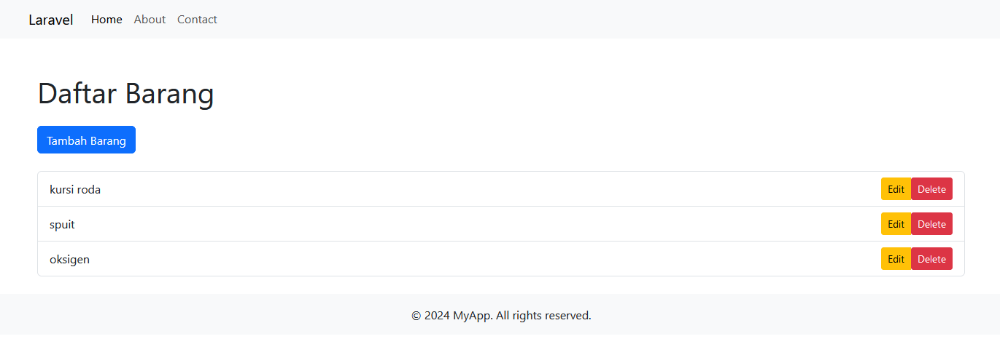

## CRUD menggunakan Laravel dengan SQLite



Langkah-langkah untuk menjalankan project Laravel
1. Install Dependensi dengan Composer
    ```
    composer install
    ```
2. Pastikan File .env Tersedia <br>
    ```
    cp .env.example .env
    ```
    ```
    php artisan key:generate
    ```
3. sesuaikan .env <br>
untuk project ini 
    ```
    DB_CONNECTION=sqlite
    ```
4. Migrasi database
    ```
    artisan migrate
    ```
5. Jalankan project <br>
    ```
    artisan serve
    ```
